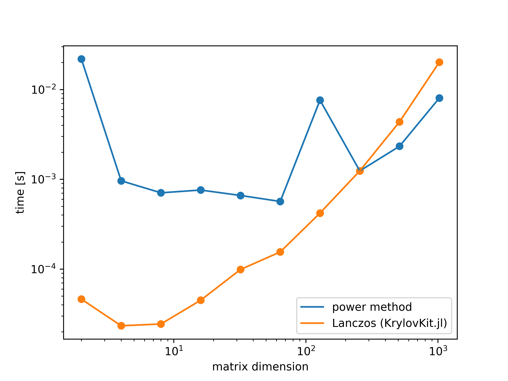
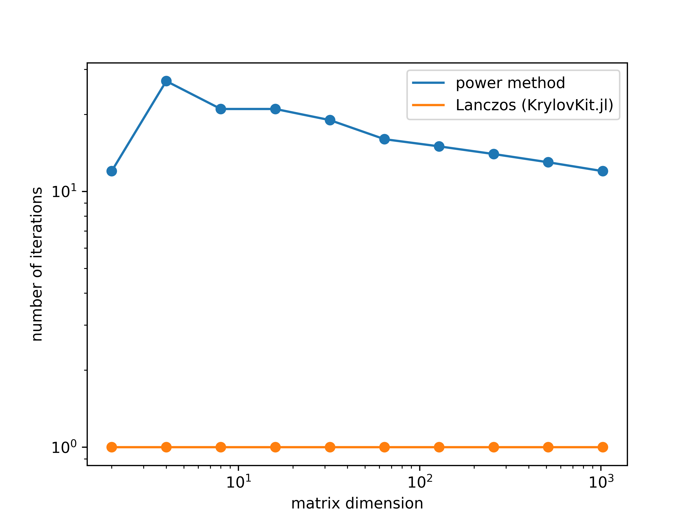
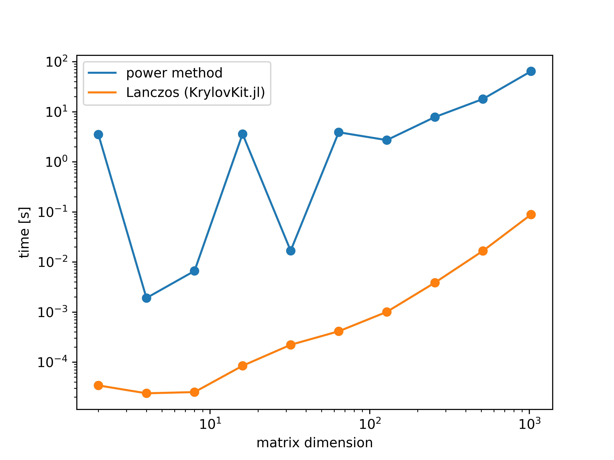
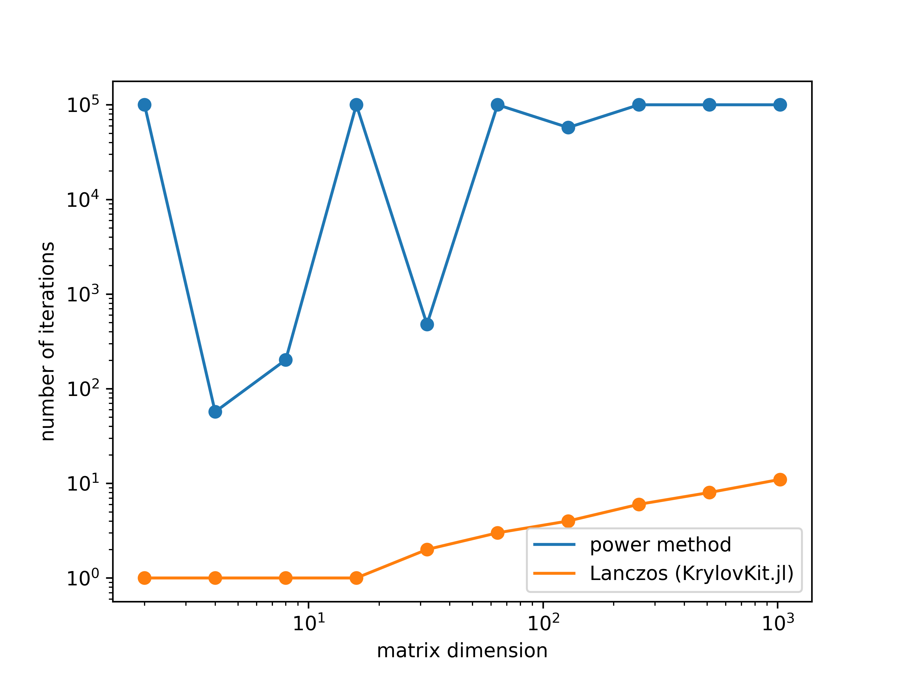

# [Theory of Quantum Systems for Beginners](https://github.com/hallerinos/LabClass_QuantumSystems)

During this two-day lab class, you will learn basic analytic and computational methods we use in the [Theory of Mesoscopic Quantum Systems](https://wwwfr.uni.lu/recherche/fstm/dphyms/research/theory_of_mesoscopic_quantum_systems) group.
On both days, you will receive lectures in the morning, followed by programming sessions in the afternoon.
We focus on two important techniques, exact diagonalization (ED) and matrix product states (MPS).

You will need to develop your own codes in order to investigate an assignment, and you may choose one of three subjects, with increasing complexity
1. The Ising model: spontaneous symmetry breaking, local order parameters, order and disorder in quantum magnets (easy)
2. The Bose-Hubbard model: superfluids and Mott-insulators (intermediate)
3. Topological quantum matter: exotic bound modes and non-local order parameters (advanced)

You need to tell me which topic you like after the first day, based on which I prepare a lecture and a specific assignment for the second day.

# Exact Diagonalization
This technique is a brute-force approach to numerical simulations of condensed matter systems, because it constructs the Hamiltonian operator in a suitable vector space, followed by a straightforward diagonalization in order to access the spectrum.

Mathematically, exact diagonalization corresponds to finding solutions of the stationary Schrödinger equation in Dirac notation
$$
\hat H \ket{\psi_n} = E_n\ket{\psi_n}
$$
in which $\hat H$ corresponds to the Hamiltonian operator and $\ket{\psi_n}\in\mathcal H$ is the corresponding eigenstate of $\hat H$ with eigenvalue $E_n$.
Note that the Hamiltonian can be represented as a matrix in an arbitrary basis $\{\phi_n\}$, with matrix elements $H_{mn}^\phi = \braket{\phi_m | \hat H|\phi_n}$.
The Hamiltonian in this notation is simply 
$$
\hat H = H_{mn}^\phi\ket{\phi_m}\bra{\phi_n}.
$$
Please note that I use the sum convention.
The matrix elements depend of course on the choice of the basis, and $H_{mn}^\psi = E_n\delta_{mn}$ is diagonal.
In a typical situation, the Hamiltonian is written in a canonical basis (e.g. in a real-space basis where $\ket{\phi_n}$ is localized at position $n$), such that the matrix elements $H_{mn}^\phi$ are known, but the eigenvalues $E_n$ are not.

> Convince yourself that the eigendecomposition of $H^\phi_{mn}$ leads to the spectral decomposition of $\hat H$.

A diagonalization of the Hamiltonian matrix $H^\phi = U^\phi D U^{\phi\dag}$ will always lead to a unitary transformation of the form
$$
\hat H = (U^\phi D U^{\phi\dag})_{mn}\ket{\phi_m}\bra{\phi_n}
= U^\phi_{mk} D_k U^{\phi*}_{nk}\ket{\phi_m}\bra{\phi_n}
= D_k\ket{\psi_k'}\bra{\psi_k'}
$$
A comparison with the Schrödinger equation then leads to $D_k=E_k$ and $\ket{\psi_k}=\ket{\psi'_k}$ up to an irrelevant arbitrary phase.

Now, if we want to measure eigenstate observables in the canonical basis, they can be expressed in terms of the unitary transformation $U$ which diagonalizes $H^\phi$.

> Find a formula for the expectation value of a general Hermitian operator $\braket{\psi_i|\hat O|\psi_j}$. Double-check your result by computing $\braket{\psi_i|\hat H|\psi_j}$.

The expectation value of any operator, initially expressed in the canonical basis, can then be expressed in terms of the unitary rotation of $H$ to the diagonal basis, i.e.
$$
\braket{\psi_i|\hat O|\psi_j} = O^\phi_{mn}\braket{\psi_j|\phi_m}\braket{\phi_n|\psi_j} = (U^{\phi\dag} O^\phi U^\phi)_{ij}
$$

## The transverse-field Ising model (TFIM)
The TFIM is the quantum analog of the classical (Ernst) Ising model, motivated from the study of ferromagnetism in statistical mechanics.
The initial idea is the following: elementary magnets can only assume two values. They don't have dipolar magnetic interactions in the solid body (everything is rather screened) and their interaction range is limited to their very neighbors, resulting in a short-ranged exchange interaction.
Futhermore, there is an external field which induces quantum fluctuations relative to the axis of the exchange interaction.
The effect of these fluctuations in 1D is equivalent to thermal fluctuations in a 2D classical system, which can be seen in the path integral formulation.
Furthermore, the 1D quantum Ising model is THE example of quantum phase transitions, because it can be solved analytically in full glory via the transfer-matrix method.
Both analytic approaches will be presented if you want to pursue project 1.

The Hamiltonian reads
$$
\hat H = J\sum_{\braket{i,j}}\hat S^z_{\bm r_i}\hat S^z_{\bm r_j} + h \sum_{i}\hat S^x_{\bm r_i}
$$
in which $\bm r_i$ denotes some position in a Bravais lattice, and $\hat S^k_{\bm r_i}$ is the local spin-1/2 operator along the $k$ direction.
J denotes the binding energy between adjacent spins ($\braket{i,j}$ denotes a constrained sum over nearest neighbors only), and $h$ is the magnetic field amplitude associated with the Zeeman coupling.
The spin operators satisfy the same algebraic commutation relations as orbital angular momentum, i.e.
$$
[\hat S^i,\hat S^j] = i\hbar\varepsilon_{ijk}\hat S^l
$$
and they can be represented in terms of the Pauli matrices
$$
\hat S^i \simeq \frac{\hbar}2\sigma^i,
$$

$$
\sigma^0 =
\begin{pmatrix}
       1 & 0 \\
       0 & 1
\end{pmatrix}
,\
\sigma^x =
\begin{pmatrix}
       0 & 1 \\
       1 & 0
\end{pmatrix}
,\
\sigma^y =
\begin{pmatrix}
       0 & -i \\
       i & 0
\end{pmatrix}
,\
\sigma^z =
\begin{pmatrix}
       1 & 0 \\
       0 & -1
\end{pmatrix}
.
$$
Keep in mind that the Pauli matrices are a good basis for any $2\times2$ matrix, it might be imortant for some of the assignments.

In the following, we set $\hbar=1$, and remember that we thereby changed our unit of energy to a reduced Planck quantum.
Furthermore, to make our discussion easier for now, we consider a one-dimensional chain such that $\bm r_i = ia$, and set the lattice constant $a=1$.
We don't need to be careful about that because $a$ does not enter in $\hat H$, although in an actual experiment, $J$ will of course decrease if the distance between the spins is increased.

Remember that a general many-body state, composed by $N$ instances of a local Hilbert space $\ket{i_n}\in\mathcal H_n$, reads
$$
\ket\Psi = \sum_{\{i_n\}}C_{i_1,i_2,\dots,i_L}\ket{i_1,i_2,\dots,i_L}
$$
where
$$
\ket{i_1,i_2,\dots,i_L} = \ket{i_1}\otimes\ket{i_2}\otimes\dots\otimes\ket{i_L}
$$
denotes the Kronecker product.
In order to construct the local spin operators of $\hat H$, we apply the same strategy:
$$
\hat S^k_n \simeq \frac12\left(\bigotimes_{j<n}\sigma^0\right)\sigma^k\left(\bigotimes_{j>n}\sigma^0\right)
$$

> Consider $N=8,16,32,64$ instances and assume that each coefficient of $C_{\{i_n\}}$ is a `float64`. How much memory is needed to store the wavefunction? How much memory do you need for a naïve matrix expression of $H$? What is the maximum $N$ that you can simulate on your laptop? What if the Hamiltonian is perturbed by just a single term $\hat S^y_{\bm r_i}$?

> Construct the operators $\hat S^k_{n}$ in a `julia` script and demonstrate that $[\hat S^k_{m}, \hat S^l_{n}]=0\ \forall m\neq n$. Use the operators to construct the Hamiltonian.

## The eigenvalue problem
Given a $n\times n$ Hermitian matrix $A$, we want to find $m$ extremal eigenvalues and -vectors.

> Develop a method to get the job done.

1. Choose a random starting vector $b_0$
1. Construct $b_{k+1} = \frac{A b_k}{|Ab_k|}$
2. Repeat step two until convergence

The (Cornelius) Lanczos algorithm is a substantially refined version of the power method, and presently the best method to solve the eigenvalue problem of Hermitian matrices.

> Compare your implementation with the precision and runtime of an appropriate implementation in [`KrylovKit.jl`](https://github.com/Jutho/KrylovKit.jl).
Bonus: look up the Lanczos algorithm, implement it and compare your version against the KrylovKit.

These are the results for positive, symmetric, random matrices $A$. You can see that the power method is slightly faster than the KrylovKit, but the runtimes are overall comparable.

If you inspect the number of iterations needed, you can see that the power method needs a couple more steps, but each step is much faster.

(a)             |  (b)
:-:|:-:
  |  

Let's see what happens if we make the matrix $A$ a little less "well-behaved", e.g., by removing the positivity. Then, the runtime of the power method increases a lot.
Whereas the Lanczos is finished after a few iterations, the power method does not even converge anymore after 10000 steps!

(a)             |  (b)
:-:|:-:
  |  

## A blind run into the Ising model
Now that we know a bit about how to numerically solve the eigenvalue problem, let's go back to the Ising model and apply it to our first physics problem.

> Can you guess the energy and ground state for $J=\pm4$ and $h=0$?
Is there a degeneracy of the ground state? What do you expect happens for $|h|\ll |J|$? 

Let's consider the case of $J=-1$ and $h=0$.
In this case, the Hamiltonian is simply 
$$
\hat H = -4\sum_{\braket{i,j}}\hat S^z_{i}\hat S^z_{j}
$$
and we need to find the state which minimizes the energy $\braket{\hat H}$.
The Hamiltonian obviously commutes with $\hat S^z_j$, and therefore there exists a common eigenbasis of $\hat H$ and all $\{\hat S^z_j\}$ which are $\{\ket{\uparrow_j},\ket{\downarrow_j}\}$ with eigenvalues $\pm1/2$.
If adjacent spins are aligned, $\ket{\uparrow_j\uparrow_{j+1}}$ or $\ket{\downarrow_j\downarrow_{j+1}}$, they contribute with energy $-1$, and if they are anti-aligned, $\ket{\uparrow_j\downarrow_{j+1}}$ or $\ket{\downarrow_j\uparrow_{j+1}}$, they contribute with energy $+1$.
There are two orthogonal states which minimize the energy, $\ket{\Psi_\uparrow}$ and $\ket{\Psi_\downarrow}$, which are related by the operator $\hat X \simeq \prod_j\sigma^x$.
Note that this operator, together with the identity, forms a group under multiplication.

> Describe two more trivial examples of $\mathbb Z_2$, involving integer numbers. Show that $\hat X$ is a symmetry of the Ising model, i.e. $[\hat H,\hat X]=0$. What does that mean?

The lowest energy state is two-fold degenerate, and the most general ground state is $\ket\Psi = \alpha \ket{\Psi_\uparrow} + \sqrt{1-\alpha^2}\ket{\Psi_\downarrow}$.
However, the system is not truly "quantum".
What we mean by that is that the degenerate ground state is infinitely sensitive to perturbations, which leads to a so-called spontaneously symmetry-broken state in the thermodynamic limit.

> Consider a perturbation of the form $-h_z \sum_j\hat S^z_j$ (with $h_z>0$). What happens to the degenerate $\mathbb Z_2$ symmetric ground state $\ket{\Psi_\pm} = \frac1{\sqrt2}\left(\ket{\Psi_\uparrow}\pm\ket{\Psi_\downarrow}\right)$? Make your statement formal by a first order perturbation theory. From your result, argue that the unperturbed model in the thermodynamic limit can be approached in two different (non-commuting) limits.

Note that we may always choose a basis which is diagonal in $\hat H$ and $\hat X$.
The $\mathbb Z_2$ symmetric ground states are $\ket{\Psi_\pm} = \frac1{\sqrt2}\left(\ket{\Psi_\uparrow}\pm\ket{\Psi_\downarrow}\right)$, which have eigenvalues $\pm1$.
We will now investigate the effect of a local symmetry-breaking perturbation $-h_z \sum_j\hat S^z_j$ (with $h_z>0$).
We find
$$
-h_z\sum_j\braket{\Psi_s |\hat S^z_j | \Psi_{s'}} = -\sum_j\frac{h_z}4\left(\bra{\Psi_\uparrow}+s\bra{\Psi_\downarrow}\right)\left(\ket{\Psi_\uparrow}-s'\ket{\Psi_\downarrow}\right) = -\sum_j\frac{h_z}4\left(1-ss'\right),
$$
which vanishes for $s=s'$, and leads to $-\frac{h_z N}2$ for $s=-s'$.
The leading order PT eigenstates are therefore the eigenstates of $\sigma_x$ in the ordered basis $\{\ket{\Psi_+},\ket{\Psi_-}\}$, i.e.
$$
\frac1{\sqrt2}\left(\ket{\Psi_+}+\ket{\Psi_-}\right) = \ket{\Psi_\uparrow}
,\
\frac1{\sqrt2}\left(\ket{\Psi_+}-\ket{\Psi_-}\right) = \ket{\Psi_\downarrow}.
$$
We could already have guessed that from the start, because it is trivial to see that
$$
\braket{\Psi_\uparrow | \hat H - h_z \sum_j\hat S^z_j | \Psi_\uparrow} = -JN/4 - h_zN/2
$$
and
$$
\braket{\Psi_\downarrow | \hat H - h_z \sum_j\hat S^z_j | \Psi_\downarrow} = -JN/4 + h_zN/2
$$
which is also our conclusion from degenerate PT, i.e. $E^{(0)}=-JN/4$ and $\Delta E^{(1)} = \mp h_zN/2$ for the $\pm$ eigenstates of $\sigma_x$ in the ordered basis $\{\ket{\Psi_+},\ket{\Psi_-}\}$.

For finite and unperturbed systems, we have a common eigenbasis of $\hat X$ and $\hat H$, such that
$$
\braket{\hat S^z_i} = \braket{\hat X\hat S^z_i\hat X} = -\braket{\hat S^z_i} \Rightarrow \lim_{h_z\rightarrow\infty}\braket{\hat S^z_i} = 0
$$
which leads to the following statement,
$$
\lim_{N\rightarrow\infty}\lim_{h_z\rightarrow0}\braket{\hat S^z_i} = 0.
$$
Note from our PT argument, that the two limits do not commute!
This leads us to the following important conclusion, that
$$
\lim_{h_z\rightarrow0}\lim_{N\rightarrow\infty}\braket{\hat S^z_i}\neq 0
$$
signals the spontaneously broken $\mathbb Z_2$ symmetry of the Ising model.
Another way to detect spontaneous symmetry breaking without a small (symmetry breaking) field is to look for long range order in correlation functions:
$$
\braket{\hat S^z_i\hat S^z_j} \neq 0,
$$
even as $|i-j|\rightarrow\infty$ (it evaluates to $1/4$ if $h=0$).

> Now that you have an idea of the underlying physics, try to confirm your intuition numerically.

The result is as follows:
If you set $J=4$, you will see a quantum phase transition at $h=2$ (marked by a dashed line).
On the left hand side, you see the ordered phase.
The clear indicator is the presence of long-range order through the correlation function $\braket{\hat S^z_i\hat S^z_{i+1}}$. 
Note that $\braket{\hat S^z_i}=0$, which means that numerically we see fluctuations on the order of machine precision, i.e. $\mathcal O(10^{-16})$.
This is in contrast to $\braket{\hat S^x_i\hat S^x_{i+1}}$, which decouples to 
$$
\braket{\hat S^x_i\hat S^x_{i+1}} \approx \braket{\hat S^x_i}\braket{\hat S^x_{i+1}}
$$
in the disordered phase.
Furthermore, you see a clear onset of the paramagnetic phase through a polarization $M_x = \frac1N\sum_j\braket{\hat S^x_i}\approx1/2$.

# Bose-Hubbard model
The Hamiltonian of the one-dimensional Bose-Hubbard model reads
$$
\hat H = -t\sum_{\braket{i,j}}\hat a^\dag_{i}\hat a^{\vphantom\dag}_{j} - \mu\sum_{i=1}^L\hat n_i + \frac U2\sum_{i=1}^L\hat n_i(\hat n_i-1)
$$
and describes bosonic particles hopping on a discrete chain with a chemical potential $\mu$, on-site interaction $U$ and $\hat n_i = \hat a^\dag_{i}\hat a^{\vphantom\dag}_{i}$.

> What are the relations for $[\hat a_i, \hat a_j^\dag]$? Compute $[\hat a_i, \hat n_j]$. Under which transformations stays the Hamiltonian invariant up to a constant ($\hat a_i\rightarrow?$, $\hat n_i\rightarrow?$)? Compute $[H, \hat n_l]$, what does it imply for $\hat N = \sum_i\hat n_i$? Explain what you find and detail its consequences for the full Hilbert space $\mathcal H$.

> Consider the local limit $t=0$, $L=1$. Determine the condition for $n_0$ such that the energy is minimized: $n_0(\mu,U) = \min_{n\in\mathbb N}E(n,\mu,U)$ with $E(n,\mu,U)=\braket{n|\hat H|n}$. Plot $E(n_0,\mu,U)$ and $n_0(\mu,U)$ for $-1<\mu/U<2$.

> How big is the local Hilbert space? Suppose that a trial state consists of $N=L+1$ particles. Comment on the lowest energy in the limit $U\rightarrow\infty$? What is the minimum interaction energy $\frac U2\sum_i\braket{\hat n_i(\hat n_i-1)}$ for states with $N\leq L$ in the limit $U\rightarrow\infty$? Use these arguments to comment on the most probable values for $n_i$ of low-energy states in the strongly interacting case $U\gg t,\mu$.
 
> Fix the maximum value of $n_i$ for all sites to an arbitrary integer $d\geq2$. Find the matrix representations of $\hat n_i$ and $\hat a_i$ in the restricted Hilbert space. Compute the commutation relations of $\hat a_i$ in the restricted Hilbert space. What do you find? Write the Bose-Hubbard Hamiltonian in the "hard-core" limit $U\rightarrow\infty$ ($d=2$) in terms of $\hat S^{i}$. Bonus: Find out how this model is called.
 
> Diagonalize the Hamiltonian and compute the average particle number $n(\mu,U) = \braket{\hat N}/L$, the average of $a(\mu,U) = \frac1L\sum_i\braket{\hat a_i}$ and $j(\mu,U) = \braket{\hat a^\dag_{c}\hat a^{\vphantom\dag}_{c+1}}$ where $c$ is the center site of your chain. Plot your observables as a function of $(1/U,\mu)$. Discuss your results.

> Plot the real space distribution of $a_i(\mu, U) = \braket{\hat a_i}$. Comment on how you can use this information to diagonalize the Hamiltonian more efficiently. Bonus: Derive an analytic solution of the Bose-Hubbard model with the mean-field approximation.
